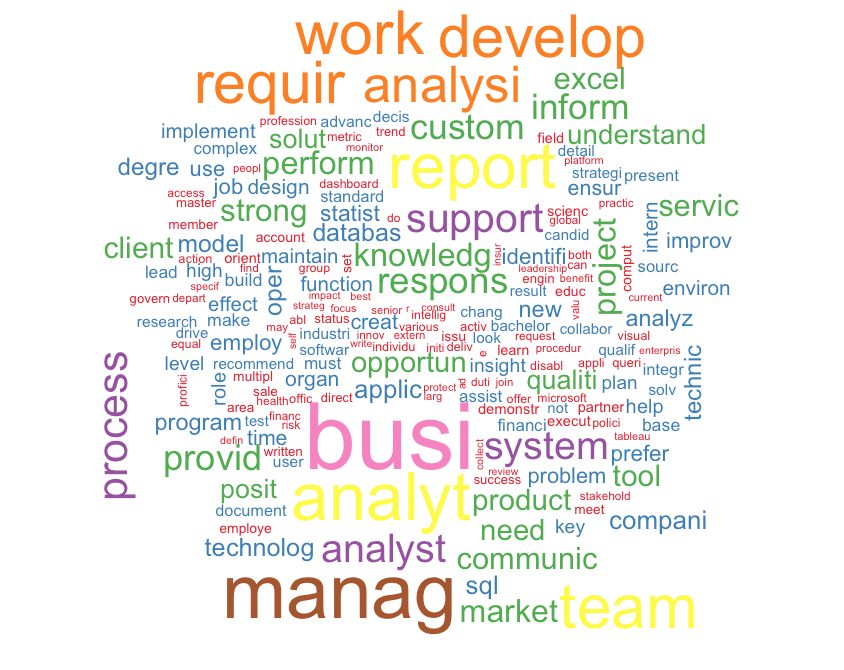

# Text mining on Data analyst job informaiton

## Overview
In order to get required details related to data analyst position, I plan to scrape the job post info from the linkedin, and implement text mining to understand the general or perferrable requrements from the employers.

##### Web scraping all the data analyst positions - Python
Generally, there are two issues during the process.

- Login Issue: 
  a. login with request session(I used)
  b. Selenium (slow / need to keep the login history)

- Ajax Issue:
  How to identify and find the data that we want to scapped.
  
#### Text Mining on the positions information

- Preprocessing:
  Nan Value removal
  Stop words list creation
  keep all letters in lower-case
  remove punctuation
  remove stop words
  remove addtional spaces

- Word frequency and co-occurance analysis

- Graphics mapping
  job distribution in selected cities
  skill sets frequency indexed significance
  key words cloud mapping
  Topic Analysis
 
#### Result

**Frequence Analysis**

In order to fully understand the frequency, I removed the meaingless words, as well as too frequent words such as data. Based on the word cloud, we could see as a data analyst, it mainly requires analysis, report, may implemnetation work. The employers expect you have business consciousness, management and teamwork skillsets, as well as capabilities working in various systems based on project and facing to different clients.

For the required skills and knowledge, statistics, database, modeling, sql, and programming are frequently appeared in the job description.

**Topic Analysis**

From the topic analysis, the expected technical skills are sql, statistics, model, tableau, python. Also, the experience also plays a huge part in decisions from employers.

https://rawgit.com/Ruby1993/Linkedin/master/vis/index.html

**Sentiment Analysis**

Based on the job descirption, most posts are purely positive, and only find two negative words in 1000 posts collected.

